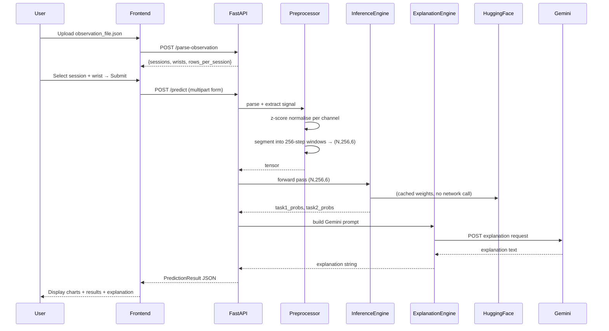

# Design Document — PADS AI Web System

## Overview

The PADS AI Web System is a full-stack research application that accepts PADS-format smartwatch observation files, preprocesses 6-channel IMU signals, runs inference through a trained Hierarchical Transformer model, and returns AI-generated medical explanations via the Google Gemini API.

The system is composed of three logical layers:

1. **Frontend** — Next.js (App Router) with Tailwind CSS, served on Vercel or Hugging Face Spaces.
2. **Backend API** — FastAPI (Python), hosted on Railway or Render.
3. **ML Model** — Hierarchical Transformer with Cross-Attention (PyTorch), hosted on Hugging Face Hub.

The application targets researchers and clinicians working with the PADS dataset (469 patients, Apple Watch Series 4, 100 Hz). It performs two binary classification tasks:
- **Task 1**: HC (Healthy Control) vs PD (Parkinson's Disease)
- **Task 2**: PD (Parkinson's Disease) vs DD (Differential Diagnosis)

> **Disclaimer**: This system is for research and educational purposes only. It does not constitute a medical diagnostic tool.

---

## Architecture

### System Architecture Diagram

```mermaid
graph TD
    User["Researcher / Clinician"]
    FE["Frontend\nNext.js App Router\nVercel / HF Spaces"]
    API["Backend API\nFastAPI\nRailway / Render"]
    HF["Hugging Face Hub\nHierarchical Transformer\nbest_model.pth"]
    Gemini["Google Gemini API\ngemini-2.0-flash"]

    User -->|Upload JSON + select session| FE
    FE -->|POST /predict (multipart)| API
    FE -->|POST /parse-observation| API
    FE -->|GET /health| API
    API -->|Load weights at startup| HF
    API -->|POST explanation prompt| Gemini
    API -->|PredictionResult JSON| FE
    FE -->|Display charts + results| User
```

### Request Lifecycle



---

## Components and Interfaces

### Frontend Components

#### `app/page.tsx` — Main Analysis Page
Orchestrates the full user workflow: upload → parse → select → submit → display. Holds top-level state and coordinates child components.

#### `components/FileUpload.tsx`
- Props: `label`, `accept`, `onFile(file: File | null)`, `error?: string`
- Renders a drag-and-drop / click-to-upload zone
- Validates `.json` extension client-side before calling `onFile`

#### `components/SessionSelector.tsx`
- Props: `sessions: SessionInfo[]`, `selectedSession`, `selectedWrist`, `onSessionChange`, `onWristChange`
- Renders session dropdown and LeftWrist/RightWrist radio buttons
- Displays row count for the selected session+wrist combination

#### `components/SignalChart.tsx`
- Props: `channel: string`, `unit: string`, `timeValues: number[]`, `signalValues: number[]`
- Renders a single interactive line chart using Recharts (zoom + pan via `recharts-zoom`)
- Displays loading skeleton when `signalValues` is empty

#### `components/ResultsPanel.tsx`
- Props: `result: PredictionResult`
- Displays Task 1 and Task 2 labels with colour-coded badges, confidence percentages, probability bars, windows analysed, session, wrist
- Shows low-confidence warning when confidence < 0.5

#### `components/PatientCard.tsx`
- Props: `patient: PatientInfo | null`
- Displays demographics: condition (ground truth), age, gender, handedness, height, weight
- Shows "No patient file uploaded" when `patient` is null
- Never renders the `id` field

#### `components/ExplanationPanel.tsx`
- Props: `explanation: string`, `loading: boolean`
- Renders the Gemini explanation in a clearly labelled card titled "AI Medical Explanation"
- Shows a spinner while `loading` is true

#### `lib/api.ts` — API Client
Typed fetch wrapper for all backend calls. Throws structured `ApiError` on non-2xx responses.

```typescript
interface ApiClient {
  parseObservation(file: File): Promise<ParseObservationResponse>
  predict(params: PredictRequest): Promise<PredictionResult>
  health(): Promise<HealthResponse>
}
```

### Backend Components

#### `main.py`
FastAPI application entry point. Registers routers, configures CORS, sets up global exception handlers, and triggers model loading at startup via `lifespan` context.

#### `routers/predict.py`
Defines the three API endpoints. Delegates to service layer. Handles HTTP-level validation and error mapping.

#### `services/preprocessor.py` — `PreprocessorService`

```python
class PreprocessorService:
    def parse_observation(self, data: dict) -> Observation
    def extract_signal(self, obs: Observation, session: str, wrist: str) -> np.ndarray  # shape (T, 6)
    def normalise(self, signal: np.ndarray) -> np.ndarray  # z-score per channel
    def segment(self, signal: np.ndarray, window_size: int = 256) -> np.ndarray  # shape (N, 256, 6)
    def preprocess(self, obs: Observation, session: str, wrist: str) -> torch.Tensor  # (N, 256, 6)
```

#### `services/inference.py` — `InferenceService`

```python
class InferenceService:
    def __init__(self, repo_id: str, config_path: str)
    def load_model(self) -> None          # called at startup
    def is_loaded(self) -> bool
    def predict(self, tensor: torch.Tensor) -> InferenceResult
        # Returns: task1_probs [p_HC, p_PD], task2_probs [p_PD, p_DD]
```

#### `services/explanation.py` — `ExplanationService`

```python
class ExplanationService:
    def __init__(self, api_key: str, model_name: str = "gemini-2.0-flash")
    def explain(self, inference_result: InferenceResult, session: str) -> str
```

#### `models/model.py` — `HierarchicalTransformer`
PyTorch `nn.Module` definition. Loaded from Hugging Face weights. Accepts input tensor `(N, 256, 6)` and returns `(task1_logits, task2_logits)` each of shape `(N, 2)`.

#### `schemas/prediction.py` — Pydantic Schemas
All request/response models. See Data Models section.

---

## Data Models

### Observation File (Input JSON — PADS format)

```json
{
  "resource_type": "observation",
  "subject_id": "001",
  "study_id": "PADS",
  "device_id": "Apple Watch Series 4",
  "sampling_rate": 100,
  "session": [
    {
      "record_name": "Relaxed",
      "rows": 2048,
      "records": [
        {
          "device_location": "LeftWrist",
          "channels": ["Time", "Accelerometer_X", "Accelerometer_Y", "Accelerometer_Z",
                       "Gyroscope_X", "Gyroscope_Y", "Gyroscope_Z"],
          "units": ["s", "g", "g", "g", "rad/s", "rad/s", "rad/s"],
          "file_name": "timeseries/001_Relaxed_LeftWrist.txt"
        }
      ]
    }
  ]
}
```

### Patient File (Input JSON — PADS format)

```json
{
  "resource_type": "patient",
  "id": "001",
  "condition": "Healthy",
  "age": 56,
  "gender": "male",
  "handedness": "right",
  "height": 173,
  "weight": 78
}
```

### Internal Python Data Models

```python
@dataclass
class SessionRecord:
    device_location: str       # "LeftWrist" | "RightWrist"
    channels: list[str]
    units: list[str]
    file_name: str             # relative path to .txt timeseries

@dataclass
class Session:
    record_name: str           # e.g. "Relaxed"
    rows: int
    records: list[SessionRecord]

@dataclass
class Observation:
    subject_id: str
    sampling_rate: int
    sessions: list[Session]

@dataclass
class PatientInfo:
    condition: str             # "Healthy" | "PD" | "DD"
    age: int | None
    gender: str | None
    handedness: str | None
    height: float | None
    weight: float | None

@dataclass
class InferenceResult:
    task1_probs: list[float]   # [p_HC, p_PD]
    task2_probs: list[float]   # [p_PD, p_DD]
    task1_label: str           # "HC" | "PD"
    task2_label: str           # "PD" | "DD"
    windows_analysed: int
```

### Pydantic API Schemas (`schemas/prediction.py`)

```python
class PredictRequest(BaseModel):
    # Delivered as multipart form fields
    session: str
    wrist: Literal["LeftWrist", "RightWrist"]
    # Files: observation_file (required), patient_file (optional)

class TaskProbabilities(BaseModel):
    HC: float | None = None    # Task 1 only
    PD: float
    DD: float | None = None    # Task 2 only

class PredictionResult(BaseModel):
    task1_label: Literal["HC", "PD"]
    task1_probabilities: dict[str, float]   # {"HC": float, "PD": float}
    task2_label: Literal["PD", "DD"]
    task2_probabilities: dict[str, float]   # {"PD": float, "DD": float}
    confidence_task1: float
    confidence_task2: float
    explanation: str
    session: str
    wrist: str
    windows_analysed: int

class ParseObservationResponse(BaseModel):
    subject_id: str
    sessions: list[SessionSummary]

class SessionSummary(BaseModel):
    record_name: str
    wrists: list[str]
    rows: int

class HealthResponse(BaseModel):
    status: Literal["ok", "degraded"]
    model_loaded: bool

class ErrorResponse(BaseModel):
    error: str
    detail: str
```

### API Endpoints

#### `POST /predict`
- Content-Type: `multipart/form-data`
- Fields:
  - `observation_file` (required): JSON file upload
  - `patient_file` (optional): JSON file upload
  - `session` (required): string
  - `wrist` (required): `"LeftWrist"` | `"RightWrist"`
- Response 200: `PredictionResult`
- Response 422: `ErrorResponse` (validation failure)
- Response 503: `ErrorResponse` (model not loaded)
- Response 413: `ErrorResponse` (file too large)

#### `POST /parse-observation`
- Content-Type: `multipart/form-data`
- Fields: `observation_file` (required)
- Response 200: `ParseObservationResponse`
- Response 422: `ErrorResponse`

#### `GET /health`
- Response 200: `HealthResponse`

### Signal Processing Pipeline (Detail)

```
observation_file.json
        │
        ▼
  parse_observation()
        │  validates resource_type, sampling_rate, sessions
        ▼
  extract_signal(session, wrist)
        │  reads .txt file → pandas DataFrame
        │  drops Time column → shape (T, 6)
        │  raises 422 if T < 256
        ▼
  normalise(signal)
        │  per-channel: μ = mean(col), σ = std(col)
        │  if σ == 0: col → 0.0  (zero-variance safety)
        │  else: col = (col - μ) / σ
        ▼
  segment(signal, window_size=256)
        │  N = T // 256  (integer division, discard tail)
        │  reshape → (N, 256, 6)
        ▼
  torch.tensor(shape=(N, 256, 6), dtype=float32)
        │
        ▼
  InferenceService.predict(tensor)
        │  model(tensor) → (task1_logits, task2_logits)  shapes (N,2)
        │  softmax per task → probabilities
        │  mean across N windows → [p_HC, p_PD], [p_PD, p_DD]
        │  argmax → task1_label, task2_label
        ▼
  ExplanationService.explain(result, session)
        │  build Gemini prompt (see template below)
        │  POST to Gemini API (timeout=10s)
        │  fallback on error
        ▼
  PredictionResult JSON → HTTP 200
```

### Gemini Prompt Template

```
You are a medical AI assistant helping researchers interpret Parkinson's Disease screening results.

Model prediction results from smartwatch movement analysis:
- Task 1 (HC vs PD): {task1_label} (confidence: {confidence_task1:.1%})
- Task 2 (PD vs DD): {task2_label} (confidence: {confidence_task2:.1%})
- Movement session analysed: {session}
- Windows analysed: {windows_analysed}

{low_confidence_warning}

Provide a concise explanation (3-4 paragraphs) covering:
1. What the movement patterns may indicate about motor function
2. Relevant motor symptoms associated with the predicted condition (tremor, bradykinesia, rigidity, etc.)
3. Recommended next steps for clinical follow-up

Important: Include a clear disclaimer that this is an AI research tool and not a clinical diagnosis.
```

Where `{low_confidence_warning}` is set to:
> "⚠️ Note: This prediction has low confidence (below 50%). Results should be interpreted with caution."

when `confidence_task1 < 0.5` or `confidence_task2 < 0.5`, otherwise omitted.

### Hugging Face Model Repository Structure

```
huggingface-repo/
├── model.py          # HierarchicalTransformer class definition (mirrors backend/models/model.py)
├── best_model.pth    # Trained weights (5-fold CV best checkpoint)
├── config.json       # Model hyperparameters (d_model, nhead, num_layers, etc.)
├── inference.py      # Standalone inference helper for HF Spaces demo
├── requirements.txt  # torch, numpy, pandas
└── README.md         # Model card with dataset info, performance metrics, usage
```

`config.json` example:
```json
{
  "input_channels": 6,
  "window_size": 256,
  "d_model": 128,
  "nhead": 8,
  "num_encoder_layers": 4,
  "num_cross_attn_layers": 2,
  "task1_classes": 2,
  "task2_classes": 2,
  "dropout": 0.1
}
```


---

## Correctness Properties

*A property is a characteristic or behavior that should hold true across all valid executions of a system — essentially, a formal statement about what the system should do. Properties serve as the bridge between human-readable specifications and machine-verifiable correctness guarantees.*

### Property 1: Preprocessing Shape Invariant

*For any* valid signal array with at least 256 rows and exactly 6 channels, the preprocessor's output tensor must have shape `(N, 256, 6)` where `N = len(signal) // 256`.

**Validates: Requirements 3.5, 4.4, 4.5**

---

### Property 2: Probability Sum Invariant

*For any* valid input tensor processed by the inference engine, both `task1_probabilities["HC"] + task1_probabilities["PD"]` and `task2_probabilities["PD"] + task2_probabilities["DD"]` must equal `1.0` within a tolerance of `1e-5`. This invariant must hold at both the inference service level and in the final API JSON response.

**Validates: Requirements 5.3, 5.4, 7.4, 7.5**

---

### Property 3: Normalisation Ordering Preservation

*For any* signal channel with non-zero variance, if value `A > B` before z-score normalisation, then `normalised(A) > normalised(B)` after normalisation. The relative ordering of all values within each channel must be preserved.

**Validates: Requirements 4.2**

---

### Property 4: Zero-Variance Channel Safety

*For any* signal where one or more channels have zero variance (all values identical), the normalisation step must produce all-zero values for those channels and must not raise any exception (e.g. division-by-zero).

**Validates: Requirements 4.3**

---

### Property 5: Observation Round-Trip Serialisation

*For any* valid observation JSON dict, parsing it into an `Observation` object, serialising that object back to a dict, and re-parsing the dict must produce an `Observation` object equivalent to the original (same `subject_id`, `sampling_rate`, and identical `sessions` list).

**Validates: Requirements 11.2**

---

### Property 6: Resource Type Validation

*For any* uploaded file whose parsed JSON does not contain the expected `resource_type` value (`"observation"` for observation files, `"patient"` for patient files), the API must return HTTP 422 with an `ErrorResponse` containing a non-empty `error` field.

**Validates: Requirements 1.6, 1.7**

---

### Property 7: Session Availability in Parse Response

*For any* valid observation file containing `N` sessions, the `POST /parse-observation` response must contain exactly `N` entries in the `sessions` array, with `record_name` values matching those in the input file exactly.

**Validates: Requirements 2.1**

---

### Property 8: Argmax Label Consistency

*For any* pair of task probabilities `[p_A, p_B]` returned by the inference engine, the predicted label must correspond to the class with the higher probability: if `p_A > p_B` then label is the first class, otherwise the second class.

**Validates: Requirements 5.6**

---

### Property 9: Insufficient Signal Rejection

*For any* signal with fewer than 256 rows, the preprocessor must raise a validation error that causes the API to return HTTP 422 with an appropriate error message.

**Validates: Requirements 3.3**

---

### Property 10: API Response Schema Completeness

*For any* successful `POST /predict` request, the JSON response must contain all ten required fields: `task1_label`, `task1_probabilities`, `task2_label`, `task2_probabilities`, `confidence_task1`, `confidence_task2`, `explanation`, `session`, `wrist`, `windows_analysed` — each with the correct type as defined in the `PredictionResult` schema.

**Validates: Requirements 7.1, 7.2, 7.3**

---

## Error Handling

### Backend Error Taxonomy

| HTTP Status | Condition | `error` field |
|---|---|---|
| 200 | Success | — |
| 413 | File exceeds 10 MB | `"File too large"` |
| 422 | Schema / validation failure | Descriptive field-level message |
| 503 | Model not loaded from HF | `"Model unavailable. Please try again later."` |
| 500 | Unhandled exception | `"Internal server error"` |

All error responses conform to `ErrorResponse`:
```json
{ "error": "...", "detail": "..." }
```

### Specific Error Conditions

**Observation file validation**
- Missing `resource_type` or wrong value → 422
- Empty `sessions` array → 422
- `sampling_rate` not a positive integer → 422
- Requested session not found in file → 422
- Requested wrist not found in session → 422
- Signal has < 256 rows → 422

**File upload**
- File > 10 MB → 413
- Non-JSON content type → 422

**Model / inference**
- Model not loaded at startup → 503 on any `/predict` call
- Forward pass timeout (> 15s) → 500 with logged stack trace

**Gemini API**
- Timeout (> 10s) or API error → fallback string returned (no HTTP error propagated to client)
- Fallback: `"AI explanation unavailable. Please consult a medical professional for interpretation of these results."`

### Frontend Error Handling

- All API errors: extract `error` field from JSON body and display in a dismissible error banner
- Network failure (fetch throws): display `"Network error — please check your connection and try again."`
- File type validation: client-side check before upload, display `"Please upload a valid JSON file"`
- Model degraded (health check): display warning banner `"Model is currently unavailable — analysis may fail"`

### Global Exception Handler (FastAPI)

```python
@app.exception_handler(Exception)
async def global_exception_handler(request, exc):
    logger.exception("Unhandled exception")
    return JSONResponse(
        status_code=500,
        content={"error": "Internal server error", "detail": str(exc)}
    )
```

---

## Testing Strategy

### Dual Testing Approach

Both unit tests and property-based tests are required. They are complementary:
- **Unit tests** verify specific examples, integration points, and error conditions
- **Property-based tests** verify universal invariants across randomly generated inputs

### Property-Based Testing Library

**Backend (Python)**: [Hypothesis](https://hypothesis.readthedocs.io/) — the standard PBT library for Python.

Each property test must run a minimum of **100 iterations** (configured via `@settings(max_examples=100)`).

Each property test must include a comment tag in the format:
```
# Feature: pads-ai-web-system, Property {N}: {property_text}
```

### Property Test Specifications

Each correctness property from the design maps to exactly one property-based test:

| Property | Test Function | Hypothesis Strategy |
|---|---|---|
| P1: Shape Invariant | `test_preprocessing_shape_invariant` | `arrays(float32, shape=(T, 6))` where `T >= 256` |
| P2: Probability Sum | `test_probability_sum_invariant` | `arrays(float32, shape=(N, 256, 6))` |
| P3: Ordering Preservation | `test_normalisation_ordering` | `arrays(float32, shape=(T, 6))` with non-zero std |
| P4: Zero-Variance Safety | `test_zero_variance_channel` | `arrays(float32, shape=(T, 6))` with ≥1 constant column |
| P5: Round-Trip Serialisation | `test_observation_round_trip` | `builds(Observation, ...)` via Hypothesis `@composite` |
| P6: Resource Type Validation | `test_resource_type_validation` | `dictionaries(text(), text())` without correct `resource_type` |
| P7: Session Availability | `test_session_availability` | `builds(ObservationDict)` with random session lists |
| P8: Argmax Consistency | `test_argmax_label_consistency` | `floats(0,1)` pairs normalised to sum to 1 |
| P9: Insufficient Signal | `test_insufficient_signal_rejection` | `arrays(float32, shape=(T, 6))` where `T < 256` |
| P10: Response Schema | `test_api_response_schema` | Full integration test with generated valid inputs |

### Unit Test Specifications

Unit tests focus on specific examples, integration points, and error conditions:

**Preprocessor unit tests** (`tests/test_preprocessor.py`):
- Parse a known observation JSON and verify field values
- Extract signal from a known session+wrist and verify shape
- Verify z-score normalisation produces mean ≈ 0, std ≈ 1 on a known array
- Verify zero-variance channel produces all-zero output
- Verify segmentation discards trailing samples correctly
- Verify HTTP 422 on empty sessions array
- Verify HTTP 422 on missing session name
- Verify HTTP 422 on missing wrist

**Inference unit tests** (`tests/test_inference.py`):
- Mock model forward pass and verify probability shapes
- Verify mean aggregation across windows
- Verify argmax label derivation for known probability pairs
- Verify `is_loaded()` returns False before `load_model()` is called

**Explanation unit tests** (`tests/test_explanation.py`):
- Mock Gemini API success → verify explanation length ≥ 50 chars
- Mock Gemini API timeout → verify fallback string is returned
- Verify low-confidence warning is included in prompt when confidence < 0.5
- Verify patient identifiers are not included in the prompt

**API integration tests** (`tests/test_api.py`):
- `GET /health` returns 200 with correct schema
- `POST /parse-observation` with valid file returns correct session list
- `POST /predict` with valid multipart form returns 200 with all required fields
- `POST /predict` with file > 10 MB returns 413
- `POST /predict` with wrong resource_type returns 422
- `POST /predict` with signal < 256 rows returns 422
- `POST /predict` with invalid session+wrist returns 422

**Frontend unit tests** (`frontend/__tests__/`):
- `FileUpload`: renders file input with `accept=".json"`, shows error on non-JSON selection
- `SessionSelector`: renders all sessions from parsed observation, defaults to "Relaxed"
- `ResultsPanel`: displays correct labels, confidence percentages, low-confidence warning
- `PatientCard`: shows "No patient file uploaded" when patient is null, never renders `id`
- `ExplanationPanel`: shows spinner when loading, renders explanation text when loaded

### Test Configuration

```python
# conftest.py / pytest settings
# Property tests: minimum 100 examples each
from hypothesis import settings
settings.register_profile("ci", max_examples=100)
settings.load_profile("ci")
```

```json
// frontend/package.json test script
"test": "jest --run"
```

### Coverage Targets

- Backend: ≥ 80% line coverage on `services/` and `schemas/`
- Frontend: ≥ 70% line coverage on `components/` and `lib/`
